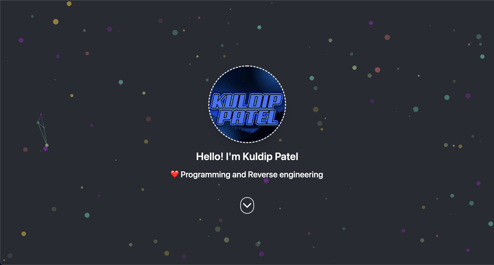

# My Portfolio
    ⚡ My portfolio, I built using React and TailwindCSS

This is open source, simple and one-page portfolio site based on react made with clearly defined and modular components which can be easily modify on your use-case.

## Live demo
Check out the live demo here 👉️ [technoaayush.xyz](https://technoaayush.xyz/)

# Getting Started with Create React App

This project was bootstrapped with [Create React App](https://github.com/facebook/create-react-app).

## Available Scripts

In the project directory, you can run:

### `npm run start`

Runs the app in the development mode.\
Open [http://localhost:3000](http://localhost:3000) to view it in your browser.

The page will reload when you make changes.\
You may also see any lint errors in the console.

### `npm run build`

Builds the app for production to the `build` folder.\
It correctly bundles React in production mode and optimizes the build for the best performance.

The build is minified and the filenames include the hashes.\
Your app is ready to be deployed!

See the section about [deployment](https://facebook.github.io/create-react-app/docs/deployment) for more information.

## Technlogy Communication
> Email: patel.kuldip91@gmail.com