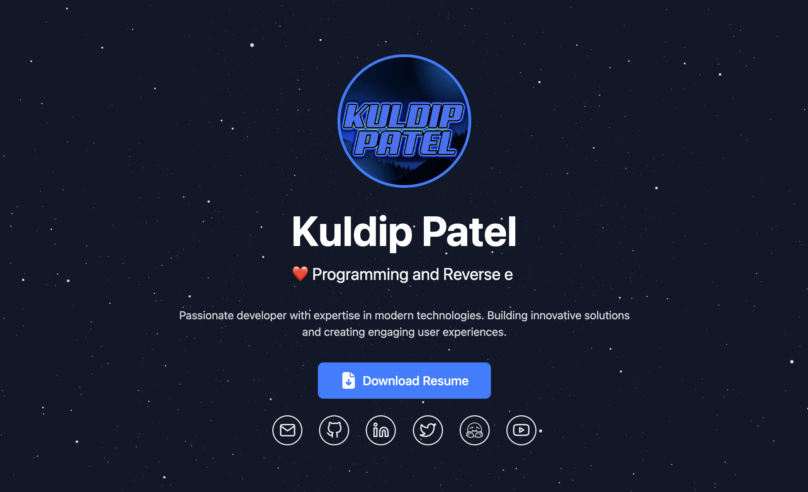

# My Portfolio

A modern, responsive portfolio website built with React, Vite, and TailwindCSS. This project showcases my work and skills with a beautiful, interactive user interface.

## 🚀 Live Demo

Check out the live demo here 👉️ [kuldippatel.dev](https://kuldippatel.dev/)



## ✨ Features

- 🎨 Modern and clean UI design
- 📱 Fully responsive layout
- ⚡ Fast performance with Vite
- 📝 Markdown blogs support
- 🏃 Smooth scrolling and transitions

## 🚀 Getting Started

### Prerequisites

- Node.js (v14 or higher)
- npm or yarn

### Installation

1. Clone the repository
```bash
git clone https://github.com/kp7742/My-Portfolio.git
cd My-Portfolio
```

2. Install dependencies
```bash
npm install
# or
yarn install
```

3. Start the development server
```bash
npm run dev
# or
yarn dev
```

4. Open [http://localhost:3000](http://localhost:3000) to view it in your browser.

## 📦 Available Scripts

- `npm run dev` - Starts the development server
- `npm run build` - Builds the app for production
- `npm run preview` - Preview the production build locally

## 🏗️ Project Structure

```
my-portfolio/
├── public/         # Static files
├── src/            # Source files
│   ├── components/ # React components
│   ├── styles/     # CSS and styling files
│   └── assets/     # Images and other assets
├── index.html      # Entry HTML file
└── vite.config.js  # Vite configuration
```

## 📝 License

This project is open source and available under the [MIT License](LICENSE).

## 📬 Contact

For any questions or suggestions, feel free to reach out:

> Email: patel.kuldip91@gmail.com